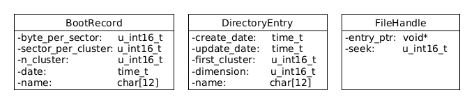

# Progetto **Pseudo FAT**
#### Martina D'Amico - 1791820 - damico.1791820@studenti.uniroma1.it

***

## Specifiche del progetto
### _Sistemi Operativi 2021-22, Prof. Grisetti_
Implement a file system that uses a pseudo "FAT" on an mmapped buffer.

The functions to implement are:

* `createFile`
* `eraseFile`
* `write` (potentially extending the file boundaries)
* `read`
* `seek`
* `createDir`
* `eraseDir`
* `changeDir`
* `listDir`

The opening of a file should return a `FileHandle` that stores the position in a `file`.

> https://gitlab.com/grisetti/sistemi_operativi_2021_22/-/blob/main/so_2021_22_projects.txt

## Premessa

Per implementare una versione simile al file system **FAT**, senza operare con gli strumenti tipici dei bassi livelli del calcolatore, si mappa lo spazio fisico su uno spazio di memoria virtuale recuperando i dati dalla memoria in modo grezzo _raw_.

## Modello Pseudo FAT
Nel seguente modello si utilizza un sottoinsieme delle funzionalità e dei dati del classico **FAT**: quelli strettamente necessari per una corretta implementazione del file system. Inoltre si adottanno delle semplificazioni, ad esempio, nel modello reale non si può prescidere da una grandezza costante quella del `disk sector` pari a `512 bytes` (per i classici _hard-disk_), nel nostro sistema si fissa tale grandezza a `32 byte`. Inoltre si gestiscono solamente file di testo e i nomi dei files e delle directory avranno una lunghezza massima di 12 caratteri. I files non potranno avere una dimensione maggiore di 65535 byte.

## Rappresentazione dello spazio
Lo spazio virtuale, mappato in memoria, che modella il "disco fisico" viene suddiviso come segue


### Boot record
Occupa il primo settore del volume e conserva informazioni generali, come di seguito descritto.

|offset (byte)|size (byte)|descrizione|
|:------------|:----------|:----------|
|0|2|Numero di byte per settore|
|2|2|Numero di settori per cluster|
|4|2|Numero di cluster|
|6|2|Numero di `entries` per le `Directory Table` inclusa la `Root Directory`. In particolare il numero di entry deve essere minore o uguale al numero di settori per cluster|
|8|8|Data di creazione del volume (in millisecondi)|
|16|12|Nome del volume, incluso il carattere di terminazione|
|28|4|Spazio inutilizzato|

### FAT

La file allocation table è il cuore del filesystem da cui prende il nome. Questa tabella è di fondamentale importanza per gestire il file system secondo il paradigma della _allocazione per concatenazione_. Attraverso la **FAT** il sistema recupera il contenuto dei files, memorizzati nella `data area` all'interno di uno o più cluster, non necessariamente consecutivi, ma sequenzialmente ordinati nella **FAT**.
La **FAT** occupa un certo numero di settori subito dopo il boot record, lo spazio riservato in memoria espresso in settori è in funzione del numero di cluster definiti nel `Boot record`:

`Spazio FAT (settori) = ⌈(n_cluster * 2 / n_byte_per_settore)⌉`


|offset (byte)|size (byte)|descrizione|
|-------------|-----------|:----------|
|0|2|Può assumere i seguenti valori:|
|||0: cluster libero|
|||1: ultimo cluster del file|
|||2-65535: cluster successivo del file|

Ovviamente i cluster logici inizieranno dall'indice 2 e secondo questa implementazione non potranno essere più di 65534.

### Root Directory
Occupa un certo numero di settori, in funzione dell'impostazione del valore di numero di `entries` contenuto nel `Boot record`, ove viene memorizzata la `Directory Table`. Quest'ultima è una tabella che elenca i file e le subdirectory della root come verrà meglio specificato nel seguito. Si precisa che ogni directory del volume, inclusa la `root`, possiede una propria `Directory Table`.

#### Directory Table
E' un elenco di `directory entry` necessari per rappresentare il contenuto di una directory: `files` e `subdirectory`. Questa, in combinazione con la **FAT**, consente di recuperare i dati presenti nella data area: nella tabella è memorizzato l'entry-point di ogni file o meglio il numero del primo cluster da cui parte la ricerca che proseguirà nella FAT.

Lo spazio occupato in memoria della `Directory Table`, espresso in settori, è dato dalla seguente formula:

`Spazio Directory Table (settori) = ⌈n_directory_entries * lughezza_directory_entry / n_byte_per settore⌉`

Nel seguente modello avendo assunto che il numero di byte per settore viene fissato a 32, osservando la struttura delle `directory_entry` che occupano esattamente 32 byte, si può semplificare il calcolo come segue:

`Spazio Directory Table (settori) = n_directory_entries`

#### Directory Entry
Come già descritto la `directory entry` rappresenta un singolo record della `directory table` dove vengono memorizzate le informazioni relative ai `files` o alle `sub-directory` relativo a una determinata `directory`

|offset (byte)|size (byte)|descrizione|
|-------------|-----------|:----------|
|0|8|data di creazione (in millisecondi)|
|8|8|data di modifica (in millisecondi) (se uguale a zero si tratta di una `sub-directory` altrimenti di un file)|
|16|2|primo cluster|
|18|2|dimensione (se uguale a zero si tratta di una `sub-directory`)|
|20|12|nome|

### Data Area
Spazio riservato allo storage vero e proprio dei files e delle `Directory Table`, rappresentative delle sub-directory della root, e viene suddiviso in cluster.

### Esempio rappresentazione di un volume

```
Parametri del boot record (32 byte)
- byte per settore: 32
- n. settori per cluster: 100
- n. cluster: 600
- n. entries per le Directory Table: 50
- nome del volume: AFRODITE.fat


Spazio Boot record = ⌈32 byte / 32 byte⌉ (1 settore)
Spazio FAT = ⌈600*2 / 32 ⌉ (38 settore)
Spazio Root Directory = ⌈(32*50) byte / 32 byte⌉ (50 settori)
Spazio Data area = 1920000 (60000 settori)

il volume totale allocato è dunque di 60089 settori pari a 1922848 byte

```
### Interfaccia utente

Il programma si utilizza da terminale, in ambiente **linux**, e si avvia con il seguente comando:

`$ ./PseudoFAT [diskname]`

il parametro `diskname` (max 12 caratteri) indica il nome del disco sul quale lavorare, se non esiste si crea un nuovo disco altrimenti mappa in memoria quello passato come parametro.

|comando|sintassi |descrizione|
|:-------|:--------|:----------|
|`changeDir`|`changeDir/cd [dirname]`|cambia la `directory` di lavoro come indicato dal parametro `dirname`. In particolare per spostarsi nella cartella precedente bisogna digitare `cd ..`, se invece ci si vuole spostare nella cartella principale, la root bisogna digitare `cd .`|
|`createDir`|`createDir/md [dirname]`|crea una sub-directory, della `directory` di lavoro, utilizzando il nome passato nel parametro `dirname`|
|`createFile`|`createFile/cf [filename]`|crea un file di testo vuoto con il nome fornito dal parametro `filename`|
|`listDir`|`listDir/ld]`|elenca il contenuto della directory di lavoro|
|`eraseDir`|`eraseDir/rd [dirname]`|elimina la directory, indicata dal parametro `dirname` solamente se vuota|
|`eraseFile`|`eraseFile/rf [filename]`|elimina il file indicato dal parametro `filename`|
|`exit`|`exit/e`|chiude il programma e salva il filesystem di lavoro sul file con il nome del disco|
|`format`|`format/f`|formatta il disco di lavoro|
|`info`|`info/i`|elenca a video informazioni sul volume di lavoro|
|`read`|`read/r [filename]`|legge il contenuto del file passato come parametro e lo visualizza a schermo|
|`write`|`write/w [filename] [content]`|scrive nel file di testo, indicato dal parametro `filename`, il contenuto del parametro. `content`. Se il file non esiste lo crea|
|`seek`|`seek/s[filename][offset]`|sposta la posizione del puntatore del file indicato da `filename` su un `offset` specificato|
|`help`|`help/h [command]`|fornisce una descrizione del comando passato come parametro, se non fornito elenca i comandi disponibili|


### Activity

#### Creazione di un file
Parametri necessari: nome del file.
Per la creazione di un file, nella directory di lavoro, si verifica preliminarmente la disponibilità di una entry libera nella Directory Table, quindi la lunghezza del nome e che non esista una entry con lo stesso nome.
Fatte queste verifiche si inserisce una nuova entry.

#### Scrittura di un file
Parametri necessari: entry del file e il contenuto da scrivere.
Per la scrittura di un file è necessario, come precondizione, che il file esista come entry nella Directory Table.
Calcolata la dimensione del contenuto da scrivere si calcola quanti cluster siano necessari per la sua allocazione e si verifica che ce ne siano liberi nella FAT, quindi si scrive sui cluster facendo in modo che l'ultimo carattere sia seguito da un carattere di fine stringa NIL (nel nostro modello questo rappresenta la fine del file).
Contestualmente alla scrittura del contenuto nei cluster disponibili si aggiornerà anche la FAT.
Completata la scrittura si aggiorna la entry con la dimensione (nella quale bisogna si include il carattere di fine file) e la data di modifica.

### Strutture dati utilizzate
Le principali strutture dati utilizzate nel programma



### Esempio della rappresentazione in memoria del volume

Di seguito si mostra il dump della memoria che rappresenta un volume creato secondo i seguenti parametri:
```
..parametri disco..e ecc
```
e la seguente struttuta

```
/root
|---dir1
|---dir2
|  |---file_1.txt
|  |---file_2.txt
   |dir3
```


Fonti:
* http://osr600doc.sco.com/en/FS_admin/_The_dosfs_File_System_Type.html
* http://www.fandecheng.com/personal/interests/ewindows/msdos_functional/fat.htm
* https://www.markdownguide.org/basic-syntax/
